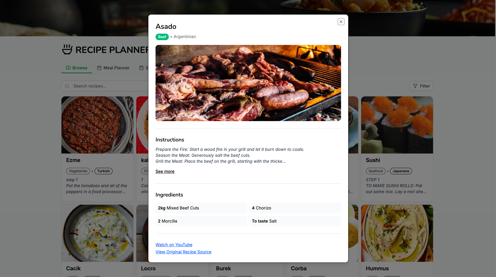
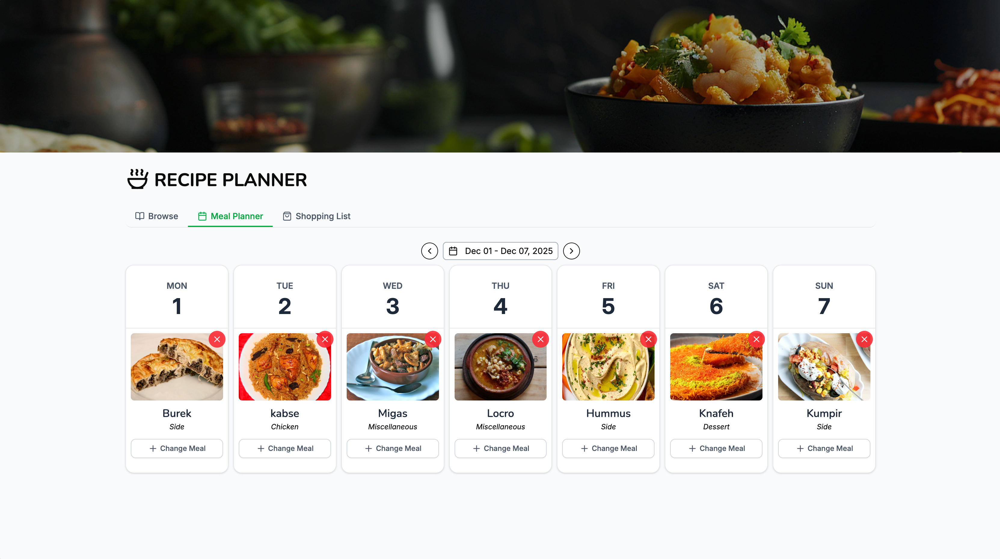
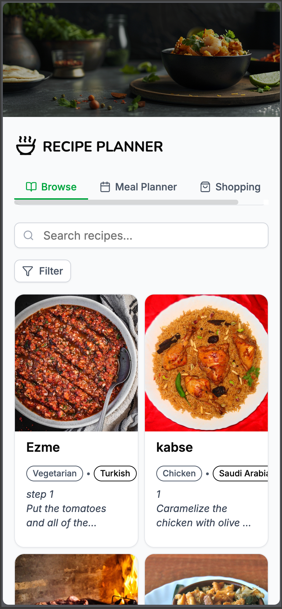
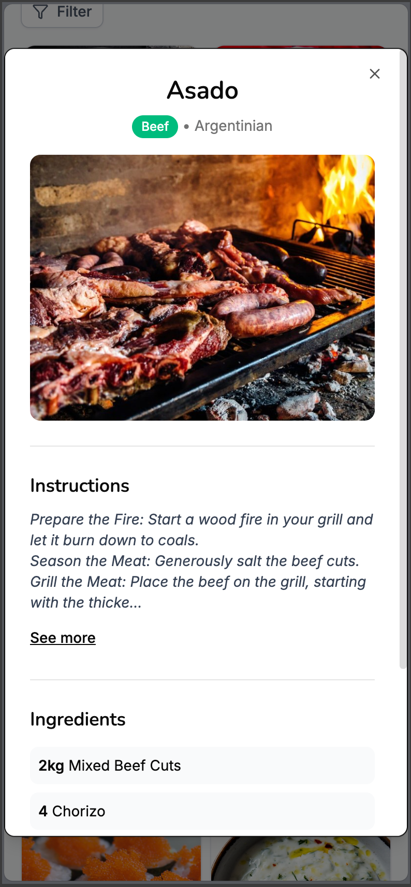
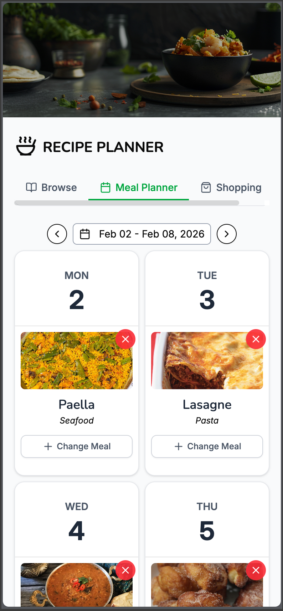

# TechCare Recipe Planner

A modern, full-featured recipe planning application built with React, TypeScript, and Redux Toolkit. This application allows users to browse recipes, plan weekly meals, and generate shopping lists automatically.

## 🚀 Setup & Run

### Prerequisites

- **Node.js**: Version 24.x or higher
- **npm** package manager with npm v11.x or higher

### Installation Steps

1. Clone the repository:

```bash
git clone https://github.com/arif1205/techcare-recipe-planner
cd techcare-recipe-planner
```

2. Install dependencies:

```bash
npm install
```

3. Set up environment variables:
   - Create a `.env` file in the root directory
   - Add the following variable:

```env
VITE_API_BASE_URL=https://www.themealdb.com/api/json/v1/1
```

4. Run the development server:

```bash
npm run dev
```

5. Build for production:

```bash
npm run build
```

6. Preview production build:

```bash
npm run preview
```

### Other Available Scripts:

- `npm run lint` - Run ESLint
- `npm run type-check` - Run TypeScript type checking errors

---

## Architecture Overview

### Folder Structure

```
src/
├── components/          # React components organized by feature
│   ├── browse-receipe/  # Recipe browsing tab components
│   ├── meal-plan/       # Meal planning calendar tab components
│   ├── shopping-list/   # Shopping list tab components
│   ├── header/          # App header component
│   ├── main/            # Main container component
│   ├── modal/           # Modal dialog components according to the feature
│   └── ui/              # Reusable UI components (mainly for shadcn/ui)
├── hooks/               # Custom React hooks
│   ├── api/             # API hooks
│   ├── recipe/          # Recipe-related hooks for recipe browsing, meal planning, and shopping list
│   ├── store/           # Redux store related hooks for Redux store
│   └── week/            # Week navigation hooks for week navigation
├── store/               # Redux toolkit store configuration
│   ├── api/             # RTK Query API setup
│   └── slice/           # Redux toolkit slices
├── types/               # TypeScript type definitions
├── lib/                 # Utility libraries (localStorage, etc.)
├── utils/               # Utility functions for recipe, store, and week related utility functions
└── data/                # Constants and configuration data
```

### State Management Approach

The application uses **Redux Toolkit** with **RTK Query** for state management and API calls:

1. **Redux Toolkit (RTK)**: Manages global application state

   - `globalSlice`: Handles meal plans, current tab, week navigation, and ingredients list
   - **Custom middleware for localStorage synchronization**

2. **RTK Query**: Handles all API calls with built-in caching

   - Automatic request deduplication
   - **Cache invalidation with tags**
   - 60-minute cache retention for optimal performance
   - **Parallel query** execution for filtered recipe searches

3. **Local Storage Integration**:
   - Persistent state across sessions
   - Automatic sync via Redux middleware

#### Why?

- Answered in the next section

### Custom Hooks Purpose, Architecture and Implementation

#### API Hooks (`useApi`)

- **Purpose**: Centralized API access point
- **Implementation**: Wraps RTK Query hooks for consistent API access
- **Benefits**: Single source of truth for API calls, easier refactoring

#### Recipe Hooks

- **`useRecipes`**: Fetches recipes with search and category filters
- **`useRecipeFilters`**: Manages search query debouncing and category selection
- **`useRecipeDetails`**: Fetches individual recipe details
- **`useMealPlan`**: Manages meal plan state and modal controls
- **`useShoppingList`**: Generates shopping list from meal plans with parallel API calls

#### Store Hooks

- **`useGlobalState`**: Access to global Redux state
- **`useMealPlanState`**: Meal plan state with date range filtering
- **`useCurrentTabState`**: Tab navigation state
- **`useCurrentWeekState`**: Week navigation with Date object conversion
- **`useIngredientsListState`**: Ingredients list management

#### Week Hooks (`useWeek`)

- **Purpose**: Week navigation and date formatting utilities
- **Features**: Previous/next week navigation, date formatting helpers, today detection

---

## Technical Decisions

### Why Redux Toolkit + RTK Query?

**Chosen Redux Toolkit over alternatives for the following reasons:**

1. **Complex State Management Needs**

   - Application manages multiple interconnected state pieces (meal plans, ingredients, tabs, week navigation)
   - Redux toolkit provides a single source of truth with predictable state updates

2. **RTK Query Integration**

   - Built-in API caching and request deduplication
   - Automatic cache invalidation with tags
   - Context API would require custom hooks and manual cache management

3. **Middleware Support**

   - Custom middleware supports
   - Debugging with Redux DevTools

4. **Performance Optimization**

   - Redux uses shallow equality checks to prevent unnecessary re-renders
   - Context API can cause all consumers to re-render on any state change
   - Better performance for large state trees

5. **Scalability**
   - Easy to add new slices without affecting existing code
   - Middleware can be added/removed without component changes

**Trade-offs:**

- **Alternatives considered**:
  - Context API - rejected due to performance and scalability concerns
  - Zustand - considered but RTK Query integration was crucial
  - Jotai/Recoil - rejected for ecosystem and community support

### Why Custom Hooks Architecture?

**Chosen because:**

- **Separation of concerns**: Business logic separated from UI
- **Reusability**: Hooks can be shared
- **Testability**: Easier to test logic separately

**Trade-offs:**

- More files and abstractions to maintain, which can increase codebase complexity

### Why shadcn/ui?

**Chosen because:**

- **Controlled components**: Full control over component code
- **Tailwind CSS**: Consistent with project styling
- **Customizable**: Easy to modify and extend

**Trade-offs:**

- More setup than a pre-built component library
- **Alternative considered**: Material-UI, Ant Design - but chose shadcn for flexibility

### Why Parallel API Calls?

**Implementation**:

- `getRecipesWithFilters` RTK Query endpoint executes search and category filters in parallel using `Promise.all()`
- `useShoppingList` hook executes recipe details in parallel using `Promise.all()`

**Benefits:**

- **faster**: Both requests execute simultaneously
- **Better UX**: Faster response times
- **Efficient**: For the RTK Query still caches both results separately.

**Trade-off:**

- Slightly more complex error handling
- **Alternative considered**: Sequential calls - but chose parallel for performance

### Why Skeleton Loaders Instead of Spinners?

**Chosen because:**

- **Better UX**: Shows content structure while loading
- **Performance**: Users see layout immediately

**Trade-off:**

- More code to maintain skeleton components
- **Alternative considered**: Simple spinners - chose skeletons for better UX

### Image Optimization Strategy

**Implementation:**

- Native `loading="lazy"` attribute on all images
- `fetchPriority="low"` for below-the-fold images
- Proper `alt` attributes for accessibility
- Responsive image sizing with Tailwind CSS

**Benefits:**

- **Performance**: Images load only when needed
- **Bandwidth savings**: Reduces initial page load
- **SEO**: Better Core Web Vitals scores

**Future improvements:**

- Use Image CDN.
- Responsive image srcset
- Blur placeholder images

---

## Time Breakdown

| Task              | Time Spent       |
| ----------------- | ---------------- |
| Setup & structure | 45 min           |
| Custom hooks      | 150 min          |
| State management  | 90 min           |
| UI components     | 300 min          |
| API integration   | 60 min           |
| Testing & fixes   | 180 min          |
| **Total**         | **~13.75 hours** |

---

## Challenges Faced

Though I do not faced any major challenges, I faced some minor challenges which are listed below:

### 1. Redux State Mutation Errors

**Problem**: Trying to mutate frozen Redux state objects when generating shopping lists.

**Solution**:

- Created deep copies of Redux state before using as accumulators.
- Used immutable update patterns (spread operators, array copying, etc.).
- Implemented proper object cloning in `useShoppingList` hook.

**Code location**: `src/hooks/recipe/useShoppingList.hooks.ts:71-103`

### 2. Date Serialization in Redux

**Problem**: Redux warning about non-serializable Date objects in actions

**Solution**:

- Store dates as ISO strings in Redux state
- Convert Date objects to ISO strings when dispatching actions
- Convert ISO strings back to Date objects in hooks for component usage
- Updated types, reducers, and hooks accordingly

**Code location**:

- `src/types/store.types.ts`
- `src/store/slice/global/globalSlice.ts`
- `src/hooks/store/global.store.hooks.ts`

### 3. Parallel API Calls Implementation

**Problem**: Need to execute search and category filter queries simultaneously for faster response time.

**Solution**:

- Used RTK Query's `queryFn` with `fetchWithBQ` helper
- Implemented `Promise.all()` for parallel execution
- Added proper error handling and result merging
- Filtered results to show intersection of both queries

**Code location**: `src/store/api/api.ts:44-141`

### 5. Shopping List Ingredient Deduplication

**Problem**: Same ingredient from multiple recipes needed proper measure aggregation

**Solution**:

- Used `reduce` to accumulate ingredients
- Check for existing ingredients before adding
- Merge measures arrays, avoiding duplicates

**Code location**: `src/hooks/recipe/useShoppingList.hooks.ts:71-103`

---

## 📸 Screenshots

### Recipe Search/Browse Page


### Recipe Details View



### Weekly Meal Plan



### Shopping List


### Mobile Responsive View






## Future Improvements

With more time, I would:

1. **Testing**

   - Unit tests for hooks with Jest
   - Integration tests for Redux store
   - E2E tests with Cypress

2. **Features**

   - Recipe favorites/bookmarks
   - Multiple meal in a single day
   - Export shopping list (PDF/CSV)
   - Week based shopping list

## Author

Name: Md. Ariful Islam

Email: imdariful71@gmail.com
